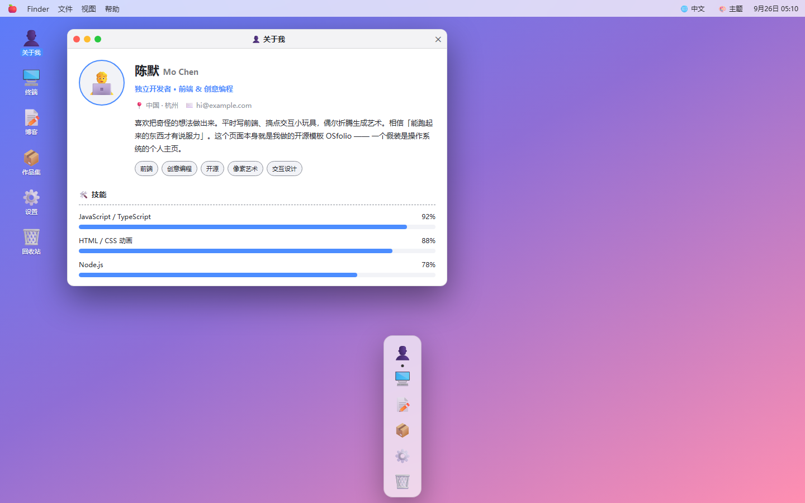
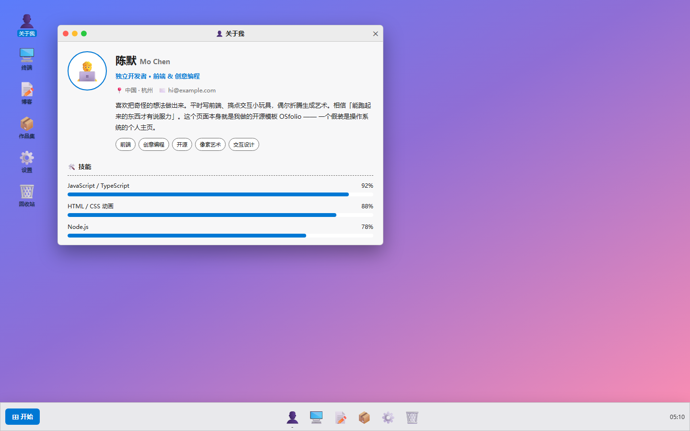
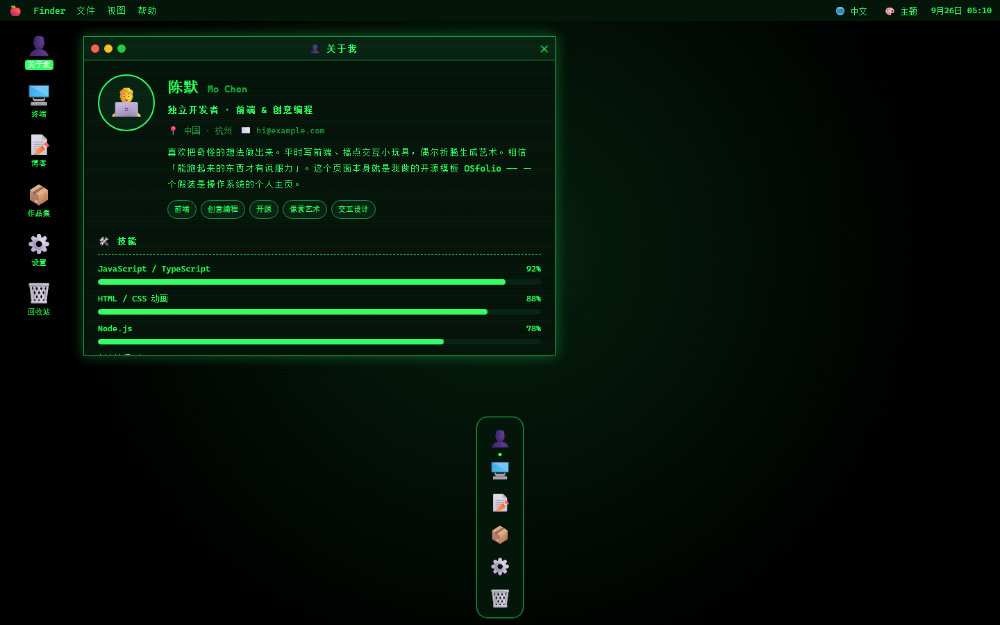
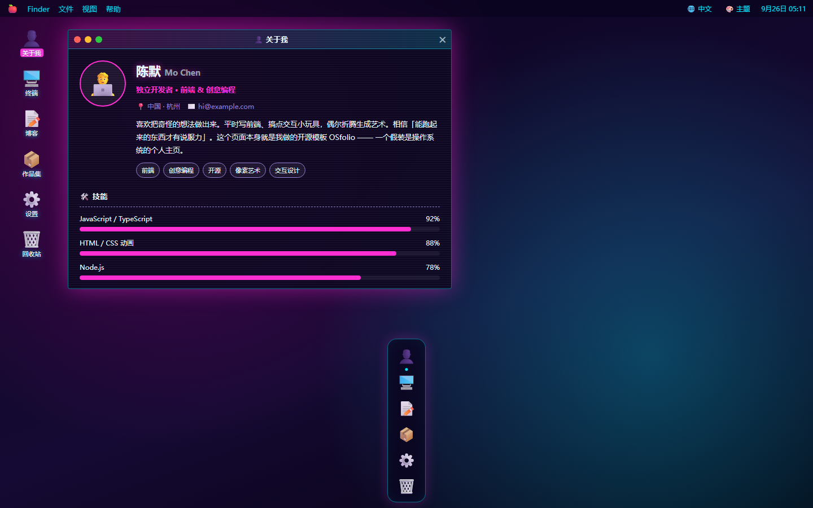
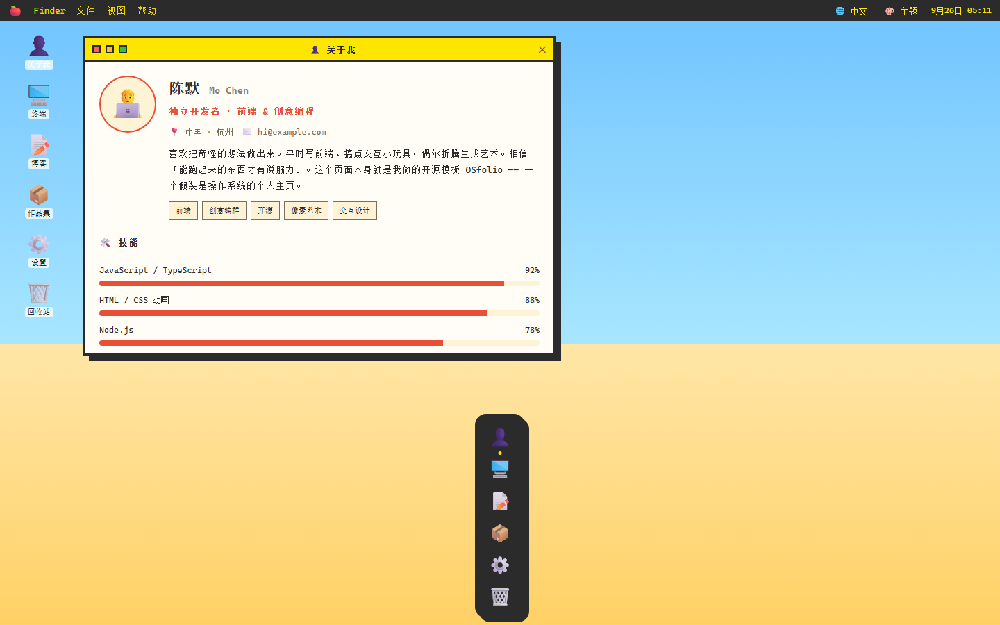
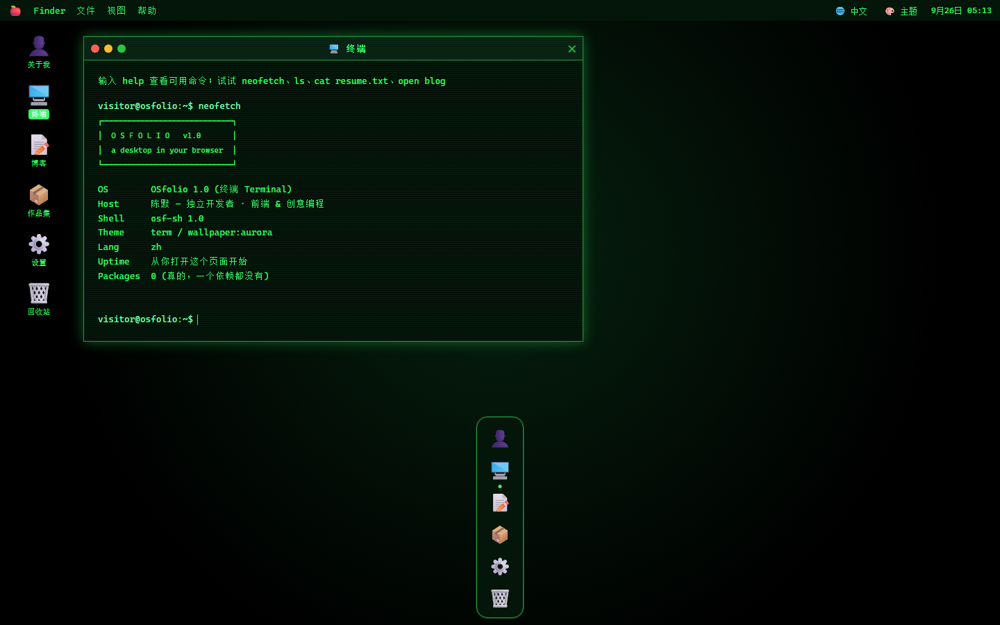

# 🖥️ OSfolio · 把个人主页做成一个操作系统

<div align="center">

**跳出传统博客模板 —— 你的简历是「关于我」应用，文章住在「资源管理器」里，还有一个真的能敲命令的终端。**

[](LICENSE)
[](https://github.com/zhenmaoge520/osfolio/stargazers)


**在线演示：https://zhenmaoge520.github.io/osfolio/**

</div>

---

## ✨ 这是什么？

一个**模拟操作系统桌面**的个人主页 / 静态博客模板：

- 🖱️ 完整的**窗口系统**：可拖拽、最小化、最大化、置顶，窗口叠窗口
- 🧑‍💻 **关于我**：简历变成了一个桌面应用（技能条、经历时间线、联系方式）
- 📝 **博客**：文章列表像资源管理器，点开即在窗口内阅读
- ⌨️ **真的能用的终端**：`ls`、`cat resume.txt`、`neofetch`、`open blog`、`sudo`（试试看会发生什么）
- 🎨 **5 套一键切换的主题**，`?theme=` 参数可直接分享某个主题的链接
- 🌐 **中英双语**，右上角一键切换，内容也跟着换
- 💾 主题 / 语言 / 壁纸选择自动记忆（localStorage）
- 📱 手机端自适应；**纯静态、零依赖**，双击 `index.html` 就能跑

## 🎨 五套主题

| macOS | Windows 11 |
|---|---|
|  |  |
| **终端 Terminal** | **赛博朋克 Cyberpunk** |
|  |  |

**复古像素 Retro Pixel**



内置可交互终端（开机自动 `neofetch`）：



## ⌨️ 终端命令

| 命令 | 作用 |
|---|---|
| `help` | 命令列表 |
| `ls` / `cd` / `cat` | 浏览一个模拟文件系统（简历、联系方式、博客都在里面） |
| `cat resume.txt` | 终端里直接看简历 |
| `open blog` | 打开博客窗口 |
| `neofetch` | 系统信息（装一下） |
| `theme pixel` | 终端里切换主题 |
| `lang en` | 切换语言 |
| `whoami` / `date` / `echo` / `clear` | 常规操作 |
| `sudo rm -rf /` | 试试？ |

快捷键：`Ctrl + ~` 或 `Alt + T` 呼出终端。

## 🚀 快速开始

**方式一：直接打开**

双击 `index.html`。就这样。

**方式二：本地服务**

```bash
git clone https://github.com/zhenmaoge520/osfolio.git
cd osfolio
python -m http.server 8080
# 打开 http://localhost:8080
```

**分享特定主题的链接：**

```
index.html?theme=cyber&lang=en      # 赛博朋克主题 + 英文
index.html?theme=pixel&app=terminal # 像素主题 + 直接打开终端
```

## ✏️ 改成你自己的（只需 1 个文件）

所有内容都在 **`js/data.js`** 里，中英文各一份，改完保存刷新即可：

```js
zh: {
  name: "陈默",              // 你的名字
  title: "独立开发者",        // 一句话头衔
  bio: "喜欢把奇怪的想法做出来…",
  skills: [{ name: "JavaScript", level: 92 }, ...],
  experience: [{ role: "前端工程师", org: "某公司", period: "2020—2023", desc: "…" }],
  posts: [{ title: "文章标题", date: "2026-09-26", tag: "技术", body: ["段落1", "段落2"] }],
  projects: [...], links: [...],
},
en: { /* 英文版，结构相同 */ }
```

- 加文章 → 往 `posts` 数组里加对象
- 加新语言 → 复制 `zh` / `en` 改成 `ja` 等（界面文案在 `js/i18n.js`）
- 加新主题 → 在 `css/themes.css` 里加一组 CSS 变量即可

## 📁 目录结构

```
osfolio/
├── index.html        # 桌面骨架 + 窗口模板
├── css/
│   ├── style.css     # 布局：窗口管理、Dock、菜单栏、各应用样式
│   └── themes.css    # 5 套主题 + 5 张壁纸（纯 CSS 变量）
├── js/
│   ├── i18n.js       # 界面文案（中/英）
│   ├── data.js       # ★ 你的全部内容：简历、文章、作品、链接
│   └── app.js        # 窗口管理器、终端、主题切换
└── assets/           # README 截图
```

## 🌍 部署

纯静态站点，扔到哪都能跑：GitHub Pages（本仓库的演示就是）、Vercel、Netlify、Cloudflare Pages，或者你自己的服务器 `nginx` 目录。

## 🤝 贡献

欢迎 PR：新主题、新终端命令（比如 `matrix`）、新应用（音乐播放器？）、无障碍改进。

## ⭐ 支持一下

如果这个模板帮你做出了好看的主页，给个 Star 就是最大的鼓励。

<div align="center">

**[🖥️ 在线体验](https://zhenmaoge520.github.io/osfolio/)** · Made with ❤️ and zero dependencies

</div>

---

## English

**OSfolio** turns your personal homepage into a desktop operating system: the résumé is an "About" app, blog posts live in a file explorer, and there's a terminal that actually works (`ls`, `cat resume.txt`, `neofetch`, `theme pixel`...).

- **5 switchable themes** — macOS / Windows 11 / Terminal / Cyberpunk / Retro Pixel (share any of them via `?theme=cyber`)
- **Bilingual** — Chinese / English, one click in the menu bar
- **Pure static, zero dependencies** — double-click `index.html` and it runs; deploy anywhere
- **All content in one file** — edit `js/data.js`, done

**Live demo**: https://zhenmaoge520.github.io/osfolio/

PRs welcome (new themes, terminal commands, apps). If it helped you, a Star is appreciated. ⭐

## 📄 License

[MIT](LICENSE) © 2026 [zhenmaoge520](https://github.com/zhenmaoge520)
